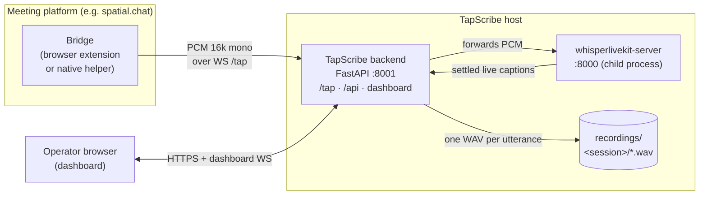
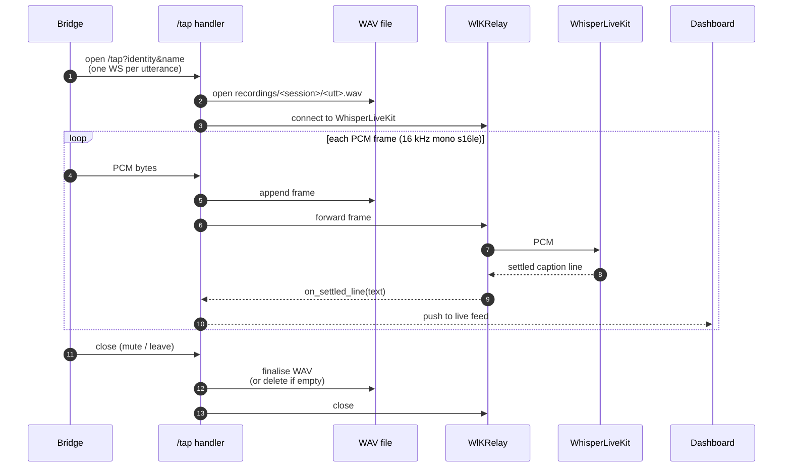

# TapScribe

Local transcription recorder and operator dashboard.

TapScribe records one WAV per utterance per speaker over a WebSocket, runs
Whisper (or Voxtral) batch transcription on demand, and supervises a
[WhisperLiveKit](https://github.com/QuentinFuxa/WhisperLiveKit) child process
for live captions. Nothing leaves the machine.

A FastAPI app serves a REST API and a dashboard at `/`:

- Start, stop, and restart `whisperlivekit-server` from the dashboard.
- One WAV per utterance per speaker, written to `recordings/<session>/`.
- Re-transcribe single WAVs or merge a whole session into one transcript.
- Hallucination filter with substring, `exact:`, and `re:` rules. Suppressed
  segments are kept in an audit array.
- Optional silero-VAD pass writes trimmed copies to `<session>/stripped/`.
  Originals are not touched.

Audio reaches TapScribe via a *bridge*: usually a browser extension that taps
the meeting platform's audio tracks and forwards raw PCM over WebSocket. The
included bridge, `spacialchat-bridge/`, targets spatial.chat. See
[`bridges/README.md`](bridges/README.md) for the wire protocol if you want to
add another.

## Quick start (macOS / Linux)

```bash
bash start.sh             # localhost only
bash start.sh --lan       # bind 0.0.0.0
```

The script finds Python 3.10+, creates `.venv`, installs dependencies
(`whisperlivekit`, `python-multipart`, `transformers`, plus `mlx-whisper` on
Apple Silicon), and launches TapScribe on port 8001 with
`whisperlivekit-server` as a child on port 8000. Child logs are prefixed
`[wlk]`. Ctrl+C stops both.

Open `http://localhost:8001/`. On first run two secrets are generated and
printed:

- A dashboard password for HTTP Basic auth, persisted to `.auth-password`.
- A `/tap` bearer token for the bridge, persisted to `.tap-token`. Paste it
  into the bridge popup along with the host and port.

Rotate with `--rotate-password` or `--rotate-tap-token`. Pass `--tls` to serve
`https://` and `wss://`; a self-signed cert is generated on first boot
(`.tapscribe-cert.pem`, `.tapscribe-key.pem`) and reused after. Supply your
own with `--cert <path> --key <path>`.

## Quick start (Windows / PowerShell)

```powershell
.\start.ps1
.\start.ps1 -Lan
```

## Configuration

Three text files under `config/` shape every job. All are re-read on every
job.

| File | Whisper feature | Format |
|---|---|---|
| `config/prompt.txt` | `initial_prompt` | Prose under ~150 words. Biases style and vocabulary. |
| `config/hotwords.txt` | `hotwords` | Comma- or space-separated proper nouns. Stronger than `initial_prompt` for names. faster-whisper only. |
| `config/hallucinations.txt` | Post-decode suppression | substring, `exact:`, or `re:`. Matches are kept in an audit array. |

Templates: `config/prompt.example.txt`, `config/hotwords.example.txt`.
`config/hallucinations.txt` ships with rules for common YouTube-trained
Whisper hallucinations.

## Architecture

One backend, one supervised child, N bridges. Audio flows in over WebSocket;
captions and recordings come out.



- **Bridges** tap a meeting platform's audio and stream raw PCM to `/tap`.
  One WebSocket per speaker per utterance. See [`bridges/README.md`](bridges/README.md).
- **Backend** (`tapscribe/`) fans each PCM frame out to two sinks: a
  per-utterance WAV on disk, and an internal relay to the supervised
  WhisperLiveKit child for live captions. It also serves the operator
  dashboard.
- **WhisperLiveKit** runs as a child process the backend starts, stops, and
  restarts from the dashboard. Bridges never talk to it directly.

### Audio pipeline (per utterance)

One `/tap` WebSocket = one utterance. Each PCM frame is tee'd: appended to
the per-utterance WAV on disk **and** forwarded to the WhisperLiveKit child
for live captions. Settled caption lines flow back to the operator
dashboard. WAV writing is independent of the live relay — if WhisperLiveKit
is down, recording still works.



## Backends

| Model | Backend | Languages | Notes |
|---|---|---|---|
| `tiny.en` / `small.en` / `medium.en` | mlx-whisper (AS) / faster-whisper | English | `small.en` is the default. |
| `large-v3` | mlx-whisper (AS) / faster-whisper | Multilingual | MLX or CUDA; CPU is slow. |
| `nb-whisper-medium` / `nb-whisper-large` | faster-whisper on CT2 weights | Norwegian | Pulled from `NbAiLab/nb-whisper-*/ct2/`. No MLX. |
| `voxtral-mini` | HF transformers | EN/ES/FR/PT/HI/DE/NL/IT | First load downloads ~6 GB. Best on CUDA. |

On Apple Silicon, live and batch both route through mlx-whisper by default.
Pass `--no-mlx` to opt out.

## Tests

```bash
pip install pytest fastapi numpy
python -m pytest tests -q
```

Tests cover the pure helpers (hallucination filter, prompt/hotwords reading,
slug parsing, WAV I/O, model routing). The Whisper, Voxtral, and silero
backends are not exercised, so the suite stays fast.

GitHub Actions runs the suite and `ruff check` on every push and PR across
Python 3.10-3.13 on Ubuntu, macOS, and Windows.

## License

MIT. See [LICENSE](LICENSE).
