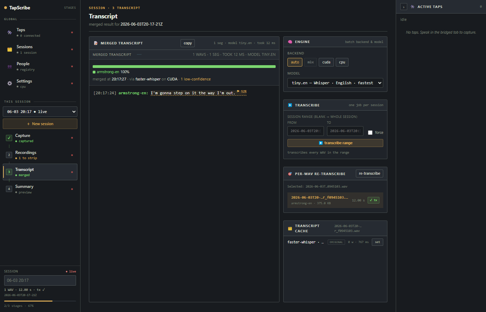
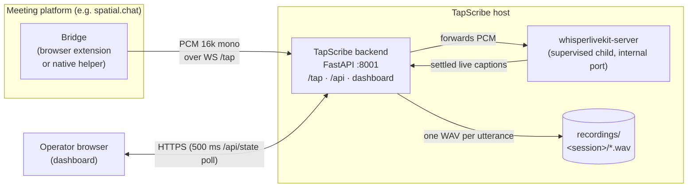
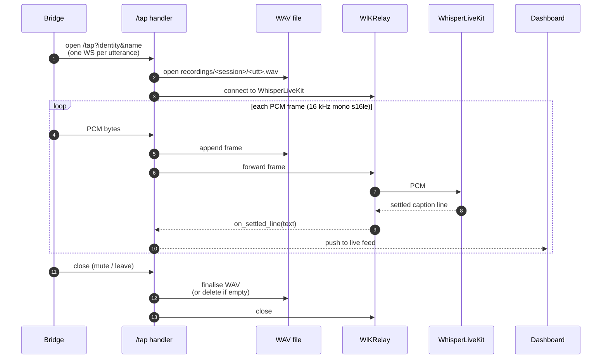

# TapScribe

Local transcription recorder and operator dashboard.

TapScribe records one WAV per utterance per speaker over a WebSocket, runs
Whisper, Voxtral, or Parakeet batch transcription on demand, and supervises a
[WhisperLiveKit](https://github.com/QuentinFuxa/WhisperLiveKit) child process
for live captions. Nothing leaves the machine.

A FastAPI app serves a REST API and a dashboard at `/`:

- Start, stop, and restart `whisperlivekit-server` from the dashboard.
- One WAV per utterance per speaker, written to `recordings/<session>/`.
- Re-transcribe single WAVs or merge a whole session into one transcript.
- Hallucination filter with substring, `exact:`, and `re:` rules. Suppressed
  segments are kept in an audit array.
- Optional silero-VAD pass writes trimmed copies to `<session>/stripped/`.
  Originals are not touched.
- Summarize a session's merged transcript — bundled local model, an
  operator CLI, or an OpenAI-compatible API — and persist the result.
- End-of-meeting pipeline: strip → transcribe → summarize as one job, so a
  Bridge can take a session from raw WAVs to a summary with no operator
  in the loop.
- People registry: a cross-session identity → display-name map, with
  merge/detach, so the same speaker keeps one name across meetings.

Audio reaches TapScribe via a *bridge*: usually a browser extension that taps
the meeting platform's audio tracks and forwards raw PCM over WebSocket. The
included bridge, `spacialchat-bridge/`, targets spatial.chat. See
[`bridges/README.md`](bridges/README.md) for the wire protocol if you want to
add another.

## Dashboard

One operator console at `/` — the "Stages" UI. A slim left spine
navigates the global views (Taps · Sessions · People · Settings) and the
per-session journey (Capture → Recordings → Transcript → Summary); the
active-taps rail on the right follows you across views. Live captions
stream in Capture; silence-stripping and the per-WAV files live in
Recordings; the **▶ transcribe range** button, the meeting-languages
declaration (you declare the meeting's languages, not a model — ADR-0011),
and the merged transcript live in Transcript; the global live and batch
engine pickers live in Settings.



The screenshot is captured live by the browser E2E test described
under [Tests](#tests), running the real Apollo 11 audio fixture
through the bridge and a real `faster-whisper` `tiny.en`.
Whisper self-flagged the imperfect output as low-confidence; bigger
models clean that up considerably.

## Quick start (macOS / Linux)

```bash
bash start.sh             # localhost only
bash start.sh --lan       # bind 0.0.0.0
```

The script finds Python 3.12+, creates `.venv`, installs dependencies
(`whisperlivekit`, `python-multipart`, `transformers`, plus `mlx-whisper` on
Apple Silicon), and launches the TapScribe recorder on port 8001. Live
captions are **off by default**: start `whisperlivekit-server` from the
dashboard (or boot with it running via `--auto-live`). When live is running,
the recorder supervises it as a child on an ephemeral internal port (pin one
with `SX_PORT_WLK`); child logs are prefixed `[wlk]`. Ctrl+C stops the
recorder and any child.

On first run, pick transcription models in the **browser setup screen**: open
`http://localhost:8001/setup` (`/` redirects there until a model is installed)
and choose Whisper / Voxtral / Parakeet — the page installs them. `/setup`
doubles as a "manage models" surface. Headless hosts can pass
`--non-interactive` to install the saved/default selection without the browser.

Open `http://localhost:8001/`. On first run two secrets are generated and
printed:

- A dashboard password for HTTP Basic auth, persisted to `.auth-password`.
- A `/tap` bearer token for the bridge, persisted to `.tap-token`. Paste it
  into the bridge popup along with the host and port.

Rotate with `.venv/bin/tapscribe --rotate-password` or `--rotate-tap-token`
(these are `tapscribe` flags, not `start.sh` flags). Pass `--tls` to `start.sh`
to serve `https://` and `wss://`; a self-signed cert is generated on first boot
(`.tapscribe-cert.pem`, `.tapscribe-key.pem`) and reused after. Supply your
own with `--cert <path> --key <path>`.

## Windows

### Windows Bundle (no Python needed)

Download **`TapScribe-Setup-win-x64.exe`** from the
[latest release](https://github.com/Vortiago/TapScribe/releases/latest) and run
it. It installs per-user (no admin prompt) and needs no Python, no checkout, and
no PowerShell — it carries its own interpreter. A tray icon starts the
dashboard, and its **Copy password** item gives you the generated dashboard
login on first run.

The Bundle is **unsigned**, so SmartScreen shows "Windows protected your PC".
Click **More info → Run anyway**.

Program files land in `%LOCALAPPDATA%\Programs\TapScribe`; your recordings,
transcripts and settings live separately in `%USERPROFILE%\TapScribe`, so
uninstalling never deletes them. Model weights are cached in
`%USERPROFILE%\.cache\huggingface`.

See [packaging/README.md](packaging/README.md) for what's in the Bundle and
[ADR-0015](docs/adr/0015-windows-bundle-embedded-interpreter.md) for why it
embeds an interpreter instead of freezing to a single binary.

### From a checkout (developers)

```powershell
.\start.ps1
.\start.ps1 -Lan
```

## Configuration

Eight files under `config/` shape transcription, live captions, and
summarization; all are re-read on every job. Most are editable from the
dashboard's Settings view instead of by hand.

| File | Shapes | Format |
|---|---|---|
| `config/prompt.txt` | Batch `initial_prompt` | Prose under ~150 words. Biases style and vocabulary. |
| `config/hotwords.txt` | Batch `hotwords` | Comma- or space-separated proper nouns. faster-whisper only. |
| `config/hallucinations.txt` | Post-decode suppression | substring, `exact:`, or `re:`. Matches are kept in an audit array. |
| `config/live-prompt.txt` | Live `--init-prompt` | Same prose format; independent of `prompt.txt`. |
| `config/live-model.txt` | Default live-channel model | Model id; the live channel adopts it on (re)start. |
| `config/batch-model.txt` | Default batch model (generalist) | Model id; what the end-of-meeting pipeline transcribes with. |
| `config/languages.txt` | Candidate languages (ADR-0010) | Comma-separated ISO codes; default `da,no,en`. |
| `config/summarizer.json` | Default summarizer | JSON: source, command/model/base_url, prompt. `api_key` is write-only. |

Templates: `config/prompt.example.txt`, `config/hotwords.example.txt`.
`config/hallucinations.txt` ships with rules for common YouTube-trained
Whisper hallucinations.

## Architecture

One backend, one supervised child, N bridges. Audio flows in over WebSocket;
captions and recordings come out.



- **Bridges** tap a meeting platform's audio and stream raw PCM to `/tap`.
  One WebSocket per speaker per utterance. See [`bridges/README.md`](bridges/README.md).
- **Backend** (`tapscribe/`) fans each PCM frame out to two sinks: a
  per-utterance WAV on disk, and an internal relay to the supervised
  WhisperLiveKit child for live captions. It also serves the operator
  dashboard.
- **WhisperLiveKit** runs as a child process the backend starts, stops, and
  restarts from the dashboard. Bridges never talk to it directly.

### Audio pipeline (per utterance)

One `/tap` WebSocket = one utterance. Each PCM frame is tee'd: appended to
the per-utterance WAV on disk **and** forwarded to the WhisperLiveKit child
for live captions. Settled caption lines flow back to the operator
dashboard. WAV writing is independent of the live relay — if WhisperLiveKit
is down, recording still works.



## After the meeting

- **Summarize** (`POST /api/sessions/{session}/summarize`) turns a session's
  merged transcript into a summary via a bundled local model, an operator
  CLI (`command`), or an OpenAI-compatible API (`api`, e.g. Ollama). The
  summary and the operator's default source/model/prompt both persist
  (`session-summary.json`, `config/summarizer.json`).
- **End-of-meeting pipeline** (`POST`/`GET /api/tap/sessions/{session}/pipeline`)
  chains strip → transcribe → summarize as one job. A Bridge triggers it
  and polls it with the tap bearer token — no dashboard needed.
- **People** (`/api/people*`) is the cross-session identity → display-name
  registry: every new speaker auto-gets a Person, merge/detach combine or
  split them, and a per-session alias can override the name for one meeting.

See [CONTEXT.md](CONTEXT.md) for the full model (Bracketed meeting, Detached
session, Person/Identity/Roster).

## Backends

| Family | Models | Backend | Languages | Notes |
|---|---|---|---|---|
| Whisper | `tiny(.en)`/`base(.en)`/`small(.en)`/`medium(.en)`, `large-v3`, `large-v3-turbo` | mlx-whisper (AS) / faster-whisper | English-only suffixes; else multilingual | `large-v3-turbo` is the default generalist (ADR-0010). |
| NB-Whisper | `nb-whisper-tiny`/`base`/`small`/`medium`/`large` | faster-whisper on CT2 weights | Norwegian | Pulled from `NbAiLab/nb-whisper-*/ct2/`. No MLX. |
| Voxtral | `voxtral-mini` | mlx-voxtral (AS) / HF transformers | EN/ES/FR/PT/HI/DE/NL/IT | Batch-only (no live channel yet). First load downloads ~6 GB. |
| Parakeet | `parakeet-tdt-0.6b-v3` | parakeet-mlx (AS) / HF transformers | 25 EU languages, no Norwegian | Batch-only (no live channel yet); replaced Canary (ADR-0006). |
| Moonshine | `moonshine-tiny`/`base` | mlx-audio (AS) / ONNX-CPU (`useful-moonshine-onnx`) | English | Live-only, lightweight low-latency captions — `MoonshineLiveChannel`. Install via `[moonshine-mlx]` / `[moonshine-cpu]` (picker: "Moonshine"). |

On Apple Silicon, live and batch both route through mlx-whisper by default.
Pass `--no-mlx` to opt out.

## Tests

```bash
pip install -e ".[dev]"
python -m pytest -q
```

Four layers:

- **Unit + route tests** (`tests/test_*.py`) cover pure helpers
  (hallucination filter, prompt/hotwords reading, slug parsing, WAV I/O,
  model routing) and FastAPI routes via `TestClient`. Whisper / Voxtral
  backends are stubbed; the suite stays under 20 s.
- **HTTP pipeline E2E** (`tests/e2e/test_pipeline_e2e.py`) boots a real
  uvicorn server, streams two synthetic WAVs concurrently through real
  `/tap` WebSockets, then walks every dashboard HTTP route to verify
  the recorder finalised the WAVs, fanned settled lines into the live
  feed, and produced a merged session transcript. Uses a
  `FakeTranscriber` so the test runs without faster-whisper installed.
- **Real-Whisper E2E** (same file, `test_pipeline_with_real_whisper`)
  streams committed CC-licensed audio fixtures (Apollo 11 English, Marlene
  Dietrich Norwegian) through the bridge and runs real `faster-whisper`
  on what the recorder wrote. Skipped automatically when
  `faster-whisper` isn't installed. See
  [`tests/fixtures/audio/README.md`](tests/fixtures/audio/README.md) for
  licence details and how to add more clips.
- **Dashboard UI E2E** (`tests/e2e/test_dashboard_ui.py`) launches
  headless Chromium via Playwright against the running server and
  asserts on actual DOM. Two variants:
  - The fast plumbing check (synthetic WAVs + `FakeTranscriber`)
    verifies taps-rail rows appear while bridges stream, settled
    lines land in Capture's captions feed with correct per-speaker
    attribution, and Transcript's **▶ transcribe range** button
    renders the merged transcript with both speakers' text — plus the
    alias-applied copy-to-clipboard contract.
  - The real-audio check (`@pytest.mark.real_audio`) streams the
    committed Apollo 11 fixture through the bridge, clicks the same
    button, and waits for real `faster-whisper` to produce a merged
    transcript in the UI. This is what produces the screenshot in
    the [Dashboard](#dashboard) section above.

  ```bash
  pip install -e ".[dev]" && python -m playwright install chromium
  python -m pytest tests/e2e/test_dashboard_ui.py
  ```

- **Bridge browser E2E** (`tests/e2e/test_bridge_extension_e2e.py`,
  `test_bridge_meeting_e2e.py`) loads the real MV3 extension in a headed
  Chromium to test the tap/mute/pipeline flow end to end. Needs a display
  (`xvfb-run -a python -m pytest ... -m browser_e2e`); self-skips without one.

GitHub Actions runs the suite and `ruff check` on every push and PR across
Python 3.12-3.14 on Ubuntu, macOS, and Windows.

## License

MIT. See [LICENSE](LICENSE).
