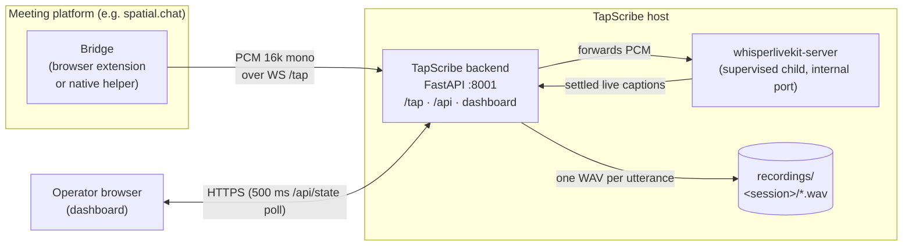

# TapScribe

Local transcription recorder and operator dashboard. TapScribe records one WAV
per utterance per speaker over a WebSocket, runs Whisper / Voxtral / Parakeet
batch transcription on demand, and supervises a
[WhisperLiveKit](https://github.com/QuentinFuxa/WhisperLiveKit) child process
for live captions. Nothing leaves the machine.

Audio arrives via a *bridge* — usually a browser extension that taps the
meeting platform's audio tracks and streams raw PCM to the `/tap` WebSocket.
The included `bridges/spacialchat-bridge/` targets spatial.chat; see
[`bridges/README.md`](bridges/README.md) for the wire protocol.

Beyond record + transcribe: a hallucination filter (substring / `exact:` /
`re:` rules; suppressed segments kept in an audit array), silence-stripping
(trimmed copies in `<session>/stripped/`, originals untouched), summarization
(bundled local model, operator CLI, or an OpenAI-compatible API), a People
registry (cross-session speaker identity → display name, with merge/detach),
and an end-of-meeting pipeline (strip → transcribe → summarize as one job a
Bridge can trigger and poll with the tap token — no operator in the loop).
[CONTEXT.md](CONTEXT.md) has the domain model.

## Dashboard

One operator console at `/` — the "Stages" UI. A slim left spine navigates the
global views (Taps · Sessions · People · Settings) and the per-session journey
(Capture → Recordings → Transcript → Summary); the active-taps rail follows you
across views. Live captions stream in Capture; silence-stripping and the
per-WAV files live in Recordings; the **▶ transcribe range** button, the
meeting-languages declaration (ADR-0011), and the merged transcript live in
Transcript; the live and batch engine pickers live in Settings.


Captured live by the browser E2E test: the Apollo 11 fixture through the
bridge and a real `faster-whisper` `tiny.en`. Bigger models clean up the
self-flagged low-confidence output considerably.

## Quick start (macOS / Linux)

```bash
bash start.sh             # localhost only
bash start.sh --lan       # bind 0.0.0.0
```

The script finds Python 3.12+, creates `.venv`, base-installs the package, and
launches the recorder on port 8001. Pick transcription models in the browser at
`http://localhost:8001/setup` (`/` redirects there until a model is installed);
`/setup` doubles as the manage-models surface. Other flags: `--non-interactive`
(headless — install the saved/default model selection without the browser),
`--no-mlx` (skip MLX on Apple Silicon; live and batch both use MLX there by
default), `--auto-live` (boot with live captions running), `--tls`, `--no-auth`
(dev only).

Live captions are **off by default**: start `whisperlivekit-server` from the
dashboard. The recorder supervises it as a child on an ephemeral internal port
(pin one with `SX_PORT_WLK`); child logs are prefixed `[wlk]`. Ctrl+C stops the
recorder and any child.

On first run two secrets are generated and printed:

- a dashboard password for HTTP Basic auth, persisted to `.auth-password`;
- a `/tap` bearer token for bridges, persisted to `.tap-token` — paste it into
  the bridge popup along with host and port.

Rotate with `.venv/bin/tapscribe --rotate-password` / `--rotate-tap-token`.
`start.sh --tls` serves `https://` + `wss://` with a self-signed cert generated
on first boot (`.tapscribe-cert.pem`, `.tapscribe-key.pem`) and reused after;
to supply your own, run `tapscribe` directly with `--tls --cert <path> --key
<path>` (recorder flags, not `start.sh` flags).

## Windows

### Windows Bundle (no Python needed)

Download **`TapScribe-Setup-win-x64.exe`** from the
[latest release](https://github.com/Vortiago/TapScribe/releases/latest) and run
it. Per-user install (no admin prompt), carries its own interpreter; a tray
icon starts the dashboard and its **Copy password** item gives you the
generated login. The Bundle is unsigned, so SmartScreen warns — click **More
info → Run anyway**. Program files land in `%LOCALAPPDATA%\Programs\TapScribe`;
recordings, transcripts and settings live in `%USERPROFILE%\TapScribe` and
survive uninstall; model weights cache in `%USERPROFILE%\.cache\huggingface`.
See [packaging/README.md](packaging/README.md) and
[ADR-0015](docs/adr/0015-windows-bundle-embedded-interpreter.md).

### From a checkout (developers)

```powershell
.\start.ps1        # flags mirror start.sh: -Lan, -NoMlx, -AutoLive, -Tls, -NonInteractive
```

## Other installs

- **PyPI**: `pip install tapscribe`, then `tapscribe`. Models still install
  via `/setup`.
- **Docker** (CPU-only): `docker run --rm -it -p 8001:8001 -v "$PWD/data:/data"
  ghcr.io/vortiago/tapscribe:latest`

## Configuration

Editable config files live under `config/` and are re-read on every job; all
are editable from the dashboard's Settings view (further knobs — chunk sizes,
timeouts, model idle TTL — live under Settings → Advanced).

| File | Shapes |
|---|---|
| `config/prompt.txt` / `live-prompt.txt` | Batch `initial_prompt` / live `--init-prompt` (independent). Prose under ~150 words. |
| `config/hotwords.txt` | Batch `hotwords` — proper nouns; faster-whisper only. |
| `config/hallucinations.txt` | Suppression rules: substring, `exact:`, or `re:`. Ships with common YouTube-trained Whisper hallucinations. |
| `config/batch-model.txt` / `live-model.txt` | Default batch / live model ids. |
| `config/languages.txt` | Candidate languages (ADR-0010); default `da,no,en`. |
| `config/summarizer.json` | Default summarizer (source, command/model/base_url, prompt; `api_key` write-only). |

## Architecture

One backend, one supervised child, N bridges. Audio flows in over WebSocket;
captions and recordings come out.



One `/tap` WebSocket = one utterance. Each PCM frame is tee'd: appended to the
per-utterance WAV on disk **and** relayed to the WhisperLiveKit child for live
captions. The two sinks are independent — if WhisperLiveKit is down, recording
still works. Bridges never talk to the child directly.

## Backends

| Family | Models | Backend | Languages | Notes |
|---|---|---|---|---|
| Whisper | `tiny(.en)`/`base(.en)`/`small(.en)`/`medium(.en)`, `large-v3`, `large-v3-turbo` | mlx-whisper (AS) / faster-whisper | English-only suffixes; else multilingual | `large-v3-turbo` is the default generalist (ADR-0010). |
| NB-Whisper | `nb-whisper-tiny`/`base`/`small`/`medium`/`large` | faster-whisper on CT2 weights | Norwegian | Pulled from `NbAiLab/nb-whisper-*/ct2/`. No MLX. |
| Voxtral | `voxtral-mini` | mlx-voxtral (AS) / HF transformers | EN/ES/FR/PT/HI/DE/NL/IT | Batch-only. First load downloads ~6 GB. |
| Parakeet | `parakeet-tdt-0.6b-v3` | parakeet-mlx (AS) / HF transformers | 25 EU languages, no Norwegian | Batch-only; replaced Canary (ADR-0006). |
| Moonshine | `moonshine-tiny`/`base` | mlx-audio (AS) / ONNX-CPU | English | Live-only low-latency captions. Extras `[moonshine-mlx]` / `[moonshine-cpu]`. |

## Tests

```bash
pip install -e ".[dev]"
python -m pytest -q
```

Unit + route tests (backends stubbed, under 20 s), an HTTP pipeline E2E over
real `/tap` WebSockets, a real-Whisper E2E on committed CC-licensed fixtures,
a Playwright dashboard-UI E2E, and a headed bridge-extension E2E. See
[CONTRIBUTING.md](CONTRIBUTING.md) for how to run each layer. GitHub Actions
runs the suite and `ruff` on every push and PR across Python 3.12-3.14 on
Ubuntu, macOS, and Windows.

## License

MIT. See [LICENSE](LICENSE).
